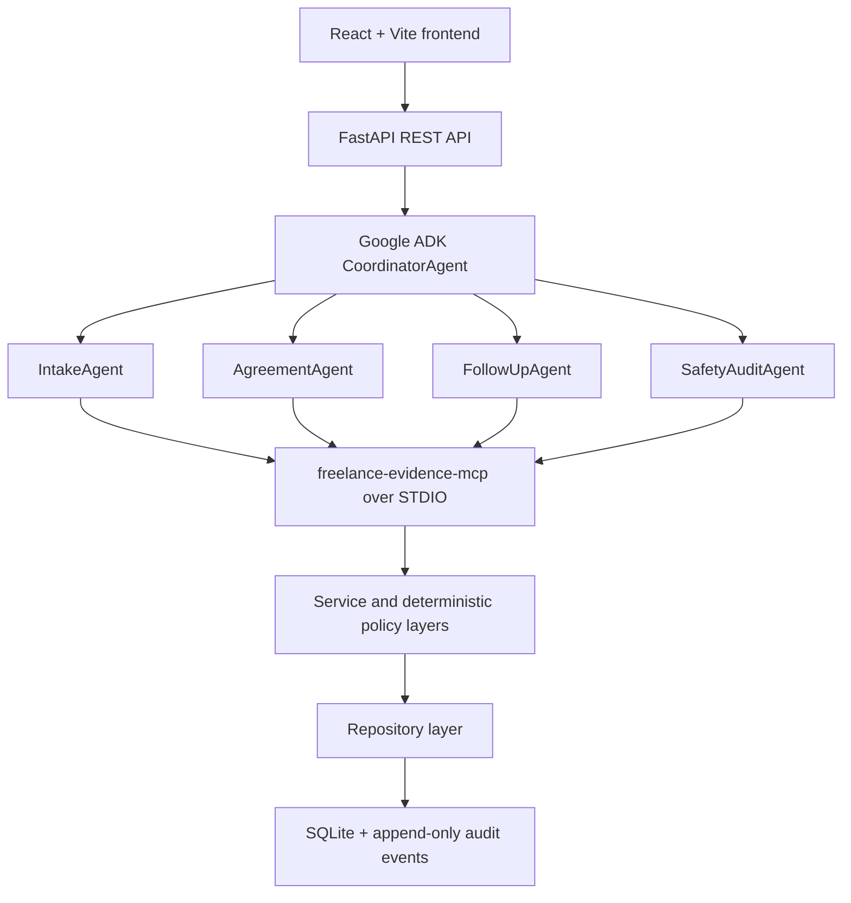

# FreelanceShield AI

FreelanceShield AI is a planned evidence-first workflow for freelancers who agree work through informal channels. It turns a client chat into structured facts, a versioned agreement, recorded acceptance, an evidence timeline, a safe communication draft, and an append-only audit trail. Generated communications are always drafts for manual review; the product does not send messages, provide legal advice, collect payment, or automate a browser.

> Repository status: Milestone 1 scaffold. The responsive React shell, FastAPI health endpoint, and single-container build are implemented. Agents, MCP, persistence, authentication, and business workflows are not implemented.

## Problem

Informal project discussions often leave scope, price, deadlines, revisions, and acceptance ambiguous. When delivery or payment is disputed, freelancers need an accurate record and neutral wording without pretending the software can establish legal rights or recover payment.

## Solution

The MVP will support one synthetic demo path:

```text
Informal client chat
→ extracted facts and unresolved terms
→ Agreement FS-001 Version 1
→ simulated client acceptance
→ delivery and invoice evidence
→ dispute or overdue policy decision
→ safety-reviewed, draft-only communication
→ evidence and audit timeline
```

## Planned architecture



The MCP server is an internal child process, not a public network service. Agents use separate, narrowly filtered toolsets and never access SQLite directly. See [Architecture](docs/ARCHITECTURE.md), [API contract](docs/API_CONTRACT.md), and [Security](docs/SECURITY.md).

## Planned agents

| Agent | Responsibility |
| --- | --- |
| `CoordinatorAgent` | Route workflows, preserve context, and return real trace events; no persistence tools. |
| `IntakeAgent` | Extract stated facts and missing terms without guessing. |
| `AgreementAgent` | Create concise, versioned agreement wording from an approved template. |
| `FollowUpAgent` | Request deterministic policy evaluation before drafting a permitted response. |
| `SafetyAuditAgent` | Block unsafe wording and verify the draft-only warning and dispute policy. |

## Planned MCP tools

| Tool | Purpose |
| --- | --- |
| `create_project` | Create a project from validated facts. |
| `save_extracted_facts` | Store structured intake output. |
| `get_contract_template` | Return approved agreement sections. |
| `create_agreement_version` | Create an immutable agreement version. |
| `record_acceptance` | Validate and record code-and-version acceptance. |
| `record_evidence_event` | Record acceptance, delivery, invoice, or scope-change evidence. |
| `get_project_timeline` | Return chronological project events. |
| `evaluate_follow_up_policy` | Select the permitted draft path deterministically. |
| `create_draft_record` | Store a safety-reviewed draft. |
| `append_audit_log` | Append an audit event. |

No tool may send messages, control a browser, collect payment, file a claim, submit a complaint, or delete audit history.

## Safety boundaries

- Client chat is quoted, untrusted data and cannot override system policy.
- Acceptance must name the matching agreement code and version.
- Scope changes create a new version and require fresh acceptance.
- A disputed project can produce only a neutral `DISPUTE_CLARIFICATION` draft.
- No generated text may claim legal enforceability, legal rights, or guaranteed recovery.
- Law-specific advice and citations are outside the MVP.
- Every generated communication must include:

  ```text
  Draft only — review and send manually.
  ```

- Evidence hashes help detect content changes; they do not prove identity, ownership, authenticity, timing, or legal admissibility.
- Demo data must be synthetic. Never commit secrets, real client chats, invoices, or personal data.

## Installation and tests

Prerequisites: Node.js 24+, npm, and Python 3.11+.

### Backend locally

```bash
cd backend
python -m venv .venv
source .venv/bin/activate
python -m pip install -r requirements.lock
python -m pytest
ruff check .
uvicorn app.main:app --reload --port 8000
```

On Windows PowerShell, activate with `.\.venv\Scripts\Activate.ps1` instead of `source .venv/bin/activate`.

### Frontend locally

```bash
cd frontend
npm install
npm run lint
npm run test
npm run build
npm run dev
```

Open `http://localhost:5173`. Vite proxies `/api` requests to the local backend at port `8000`.

### Docker

An API key is not required for Milestone 1. Compose reads `.env` when present and starts without it.

```bash
docker compose up --build
```

Open `http://localhost:8000` for the frontend or `http://localhost:8000/api/health` for the health response. The Compose service mounts `./data` at `/app/data`; it remains unused until persistence is implemented.

## Demo

Use only the synthetic inputs below:

```text
Need a poster by Friday. RM800. Two revisions.
```

```text
The poster is incomplete. I will not pay.
```

The expected result is Agreement `FS-001` Version `1`, simulated matching acceptance, delivery and invoice evidence, a deterministic dispute decision that blocks payment-demand wording, a neutral clarification draft with the manual-review warning, and a complete audit trace. See [Demo script](docs/DEMO_SCRIPT.md).

## Screenshots

Screenshots will be added only after the UI exists in Milestone 6. The reserved location is `docs/screenshots/`.

## Known limitations

- Scaffold only; intake analysis and all project workflows are intentionally inactive.
- Single-user, synthetic-data MVP.
- No real messaging, payment, legal research, browser automation, file upload, signature, or external platform integration.
- No claim that stored records or hashes establish legal ownership or admissibility.

## Capstone requirement mapping

| Requirement | Planned evidence | Target milestone |
| --- | --- | --- |
| Google ADK multi-agent workflow | Five named agents with narrow responsibilities | 4 |
| Custom MCP server | Internal `freelance-evidence-mcp` over STDIO | 3 |
| Tool permission separation | One filtered `McpToolset` per agent | 4 |
| Security tests | Required policy, prompt-injection, and permission tests | 7 |
| Docker deployability | Multi-stage image and persistent local data volume | 1, finalized in 8 |
| Polished browser UI | Full workflow, traces, warnings, and audit timeline | 6 |

## Team

Team membership and attribution have not yet been provided by the repository owner.

## Project documents

- [Product requirements](PRD.md)
- [Complete build specification](BUILD_SPEC.md)
- [Architecture](docs/ARCHITECTURE.md)
- [API contract](docs/API_CONTRACT.md)
- [Security model](docs/SECURITY.md)
- [Demo script](docs/DEMO_SCRIPT.md)
- [Agent instructions](AGENTS.md)
