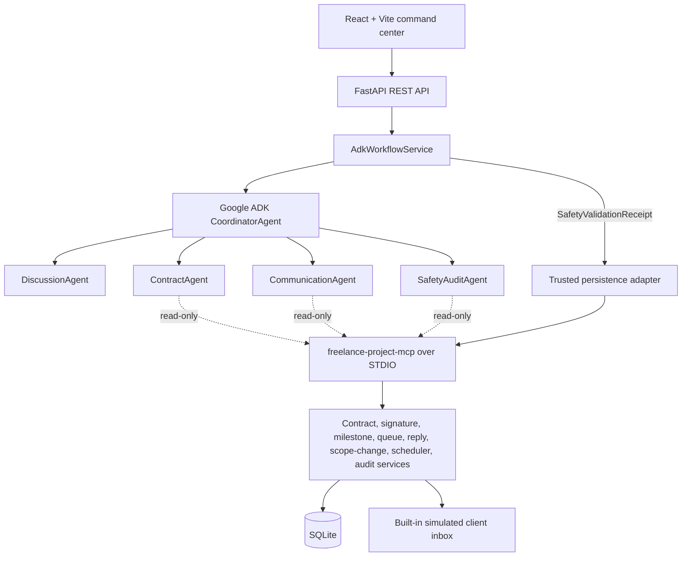

# FreelanceShield AI

FreelanceShield AI turns an informal freelance discussion into a reviewed, mutually accepted contract, then uses the latest active contract to manage milestones and safe routine project communication through a built-in simulated client inbox.

> **Repository status:** Milestones 2–4 (persistence, MCP tool surface, corrected ADK agents with trusted persistence adapter) are implemented. Milestones 5–9 (scheduler, REST API, screens, tests, demo) are pending.

## Problem

Freelancers often agree on scope, fee, deadlines, and revisions in informal chat. Repetitive updates consume time, and client replies can introduce extra work without a clear change process. FreelanceShield AI creates a versioned source of truth and automates only routine communication that is supported by the active contract and recorded freelancer actions.

## Corrected MVP

```text
informal discussion
→ extracted and reviewed terms
→ Contract FS-001 Version 1
→ freelancer acceptance
→ simulated client acceptance
→ active contract and milestones
→ freelancer records milestone progress
→ safe routine update delivered to built-in demo inbox
→ simulated client reply classified
→ possible scope change pauses automation
→ Contract Version 2
→ renewed mutual acceptance
→ full timeline and audit trace
```

The product is not a debt-recovery system. It does not send external messages, sign for either party, collect payment, provide legal advice, or guarantee enforceability or payment.

## Architecture



The scheduler, not an AI agent, authorizes and performs delivery to the internal demo inbox after deterministic checks. The MCP server is an internal STDIO process and has no public port.

## Agents

| Agent | Responsibility | Runtime ADK tools |
| --- | --- | --- |
| `CoordinatorAgent` | Route typed workflow tasks and return trace events. | None (no tools, no sub_agents) |
| `DiscussionAgent` | Extract only stated terms, ambiguity, and missing fields from untrusted discussion data. | None |
| `ContractAgent` | Create immutable FS contract versions from reviewed facts and approved templates. | `get_contract_template` (read-only) |
| `CommunicationAgent` | Draft contract-backed routine updates and classify client replies. | `get_latest_active_contract`, `get_due_communications` (read-only) |
| `SafetyAuditAgent` | Check version, progress evidence, send mode, scope-change state, and wording. | `evaluate_automation_policy` (read-only) |

No agent has mutating MCP tools. All mutations go through a trusted persistence adapter gated by a `SafetyValidationReceipt` (HMAC-SHA-256 signed, 5-min TTL).

## MCP tool surface

The restricted internal server is `freelance-project-mcp` running over a STDIO boundary.

The server registers exactly 12 tools:

| Area | Tools |
| --- | --- |
| Discussion | `create_project_from_terms`, `save_discussion_facts` |
| Contract | `get_contract_template`, `create_contract_version`, `create_signature_request`, `get_latest_active_contract` |
| Milestones | `create_milestones_from_contract` |
| Communication | `get_due_communications`, `queue_routine_update` |
| Scope change | `create_scope_change_request`, `evaluate_automation_policy` |
| Traceability | `get_project_timeline` |

### Agent access model

Agents receive only **read-only** MCP tools at runtime (`get_contract_template`, `get_latest_active_contract`, `get_due_communications`, `evaluate_automation_policy`). All mutating MCP tools (`create_project_from_terms`, `save_discussion_facts`, `create_contract_version`, `create_signature_request`, `queue_routine_update`, `create_scope_change_request`, `create_milestones_from_contract`) are called exclusively by the trusted persistence adapter after verifying a `SafetyValidationReceipt`.

### Backend-only actions (not MCP tools)
These trusted human actions are handled solely by the backend and are absent from both MCP and ADK tool groups:
- `record_signature_acceptance`
- `record_milestone_progress`
- `pause_project_automation`
- `record_client_reply`
- `append_audit_log`

### Forbidden tool policy
No MCP tool may contact WhatsApp, email, Telegram, Instagram, control a browser, sign on behalf of either party, collect payment, file a legal claim, submit a complaint, or delete/update audit logs. No raw chat data is persisted or returned in outputs/logs/errors. Errors are safe and expose no database paths, SQL, or secrets. No external messaging occurs in Milestone 3.

## Safety model

- AI cannot sign for the freelancer or client.
- A contract activates only after both parties accept the same latest version.
- AI cannot mark work ready or complete; the freelancer records milestone progress.
- Automation uses only the latest mutually accepted active contract.
- A possible scope change pauses affected automation and creates a reviewable change request.
- Routine auto-delivery is limited to the built-in demo inbox.
- Delay, scope-change, payment, dispute, compensation, extension, legal, and contract-interpretation messages require freelancer approval.
- Approval-only messages include `Draft only — review and send manually.`
- Scheduler queueing and delivery are idempotent and audited.
- Discussion and reply text are untrusted data and cannot override policy or tool permissions.

## Planned screens

1. Discussion Intake
2. Contract and Signatures
3. Project Board
4. Client Inbox
5. Communication Centre
6. Timeline and Agent Trace

`DESIGN.md` defines the command-center visual system and responsive behavior.

## Local development

Prerequisites: Node.js 24+, npm, Python 3.11+, and Docker for the container workflow.

Backend:

```bash
cd backend
python -m venv .venv
source .venv/bin/activate
python -m pip install -r requirements.lock
python -m pytest
ruff check .
GOOGLE_API_KEY=your_key uvicorn app.main:app --reload --port 8000
```

On Windows PowerShell, activate with `.\.venv\Scripts\Activate.ps1` and set `$env:GOOGLE_API_KEY` before starting Uvicorn.

Frontend:

```bash
cd frontend
npm install
npm run lint
npm run test
npm run build
npm run dev
```

Open `http://localhost:5173`; Vite proxies `/api` to FastAPI on port `8000`.

Docker:

```bash
docker compose up --build
```

Open `http://localhost:8000`. Compose reads optional `.env` configuration and mounts `./data` at `/app/data`.

These commands run the current repository implementation. The corrected workflow will become available only as the roadmap migration is completed.

## Target demo

Use synthetic data only.

Discussion:

```text
Need a poster by Friday. RM800. Two revisions.
```

Scope-change reply:

```text
Can you also make an Instagram Story version using the same design?
```

The target result is Contract `FS-001` V1, two acceptances, active milestones, a recorded first-draft event, one idempotent routine update in the demo inbox, a classified scope-change reply, paused automation, proposed V2, and a complete audit trace.

## Roadmap

| Milestone | Outcome | Status |
| --- | --- | --- |
| 0 | Corrected documentation | ✅ Done |
| 1 | Existing frontend/backend/Docker shell retained where reusable | ✅ Done |
| 2 | Contract, signature, milestone, message, reply, scope-change, and audit persistence | ✅ Done |
| 3 | `freelance-project-mcp` typed tool surface | ✅ Done |
| 4 | Corrected ADK agents, trusted persistence adapter, and SafetyValidationReceipt gate | ✅ Done |
| 5 | Scheduler, idempotency, and automation policy | Pending |
| 6 | Corrected workflow REST API | Pending |
| 7 | Six complete API-backed screens | Pending |
| 8 | Security, unit, integration, and Playwright tests | Pending |
| 9 | Demo, screenshots, seed/reset, and submission materials | Pending |

## Known limitations

- Milestones 2–4 are implemented (persistence, MCP tools, ADK agents with trusted persistence adapter). Milestones 5–9 remain pending.
- The corrected external-channel production integrations are intentionally absent; delivery is demo-inbox only.
- Real signatures, accounts, personal data, payment processing, legal advice, and public hosting hardening are out of scope.
- Team attribution and the final model/hosting choice are pending.

## Capstone mapping

| Requirement | Target evidence |
| --- | --- |
| Google ADK multi-agent workflow | Five named agents in the real contract/communication path |
| Custom MCP server | Internal `freelance-project-mcp` over STDIO |
| Tool separation | One narrow `McpToolset` per specialist |
| Business automation | Idempotent scheduler and internal demo-inbox delivery |
| Security | Mutual acceptance, progress, prompt-injection, delivery, and audit tests |
| Browser UI | Six-screen contract-driven command center |
| Deployability | Single Docker image with persistent SQLite volume |

## Project documents

- [Product requirements](PRD.md)
- [Build specification](BUILD_SPEC.md)
- [Design system](DESIGN.md)
- [Architecture](docs/ARCHITECTURE.md)
- [API contract](docs/API_CONTRACT.md)
- [Security model](docs/SECURITY.md)
- [Demo script](docs/DEMO_SCRIPT.md)
- [Agent contract](docs/AGENT_CONTRACT.md)
- [Agent instructions](AGENTS.md)
