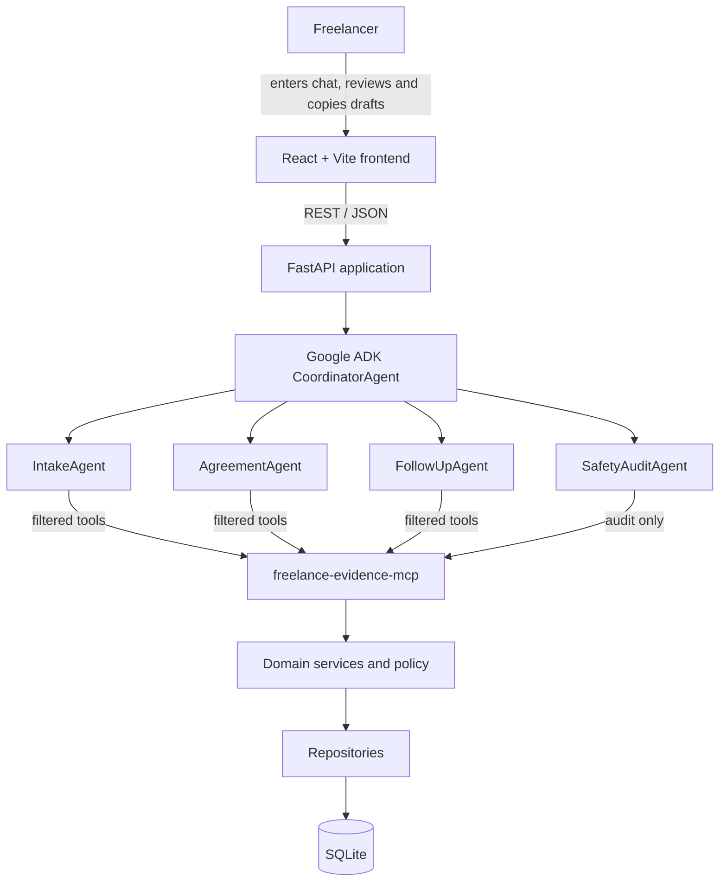
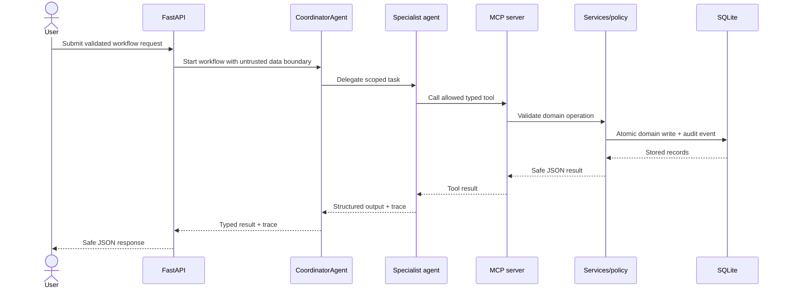

# Architecture

## Status and scope

This document describes the target MVP architecture. Milestone 1 currently implements only the React shell, FastAPI health route, local-development CORS, and combined container runtime.

## System context



The frontend and public REST API are the only user-facing runtime surfaces. The MCP server runs over STDIO as an internal child process and must not listen on a network port. No component sends messages or controls an external platform.

## Layer responsibilities

| Layer | Responsibility | Must not do |
| --- | --- | --- |
| Frontend | Collect input, render workflow state, copy drafts, show warnings and backend traces | Enforce domain policy or fabricate trace events |
| REST API | Validate requests, map safe errors, return typed contracts | Contain persistence or policy rules |
| Coordinator | Route a workflow and collect trace context | Persist directly or generate legal/payment conclusions |
| Specialist agents | Extract or draft within assigned responsibilities | Access SQLite or unfiltered tools |
| MCP server | Expose approved typed operations over STDIO | Expose public HTTP, secrets, or forbidden tools |
| Service layer | Enforce state, versioning, acceptance, evidence, and audit rules | Depend on frontend state or prompt behavior |
| Policy layer | Select permitted draft types deterministically | Delegate safety-critical routing to an LLM |
| Repository layer | Perform database reads and writes | Make product-policy decisions |
| SQLite | Store projects, agreement versions, evidence, drafts, and audit events | Act as proof of external authenticity or legal admissibility |

## Trust boundaries

1. **User input boundary:** client chat is untrusted quoted data. It is passed as a data field, never concatenated into system instructions.
2. **API boundary:** Pydantic models validate all public requests and responses. Errors expose stable codes and safe messages only.
3. **Agent/tool boundary:** each agent receives a separate `McpToolset` filtered to its explicit allowlist.
4. **MCP/STDIO boundary:** MCP messages use stdout; operational logs use stderr. Tool results are JSON-compatible dictionaries without environment, database, prompt, or stack-trace details.
5. **Persistence boundary:** only repositories access SQLite. Agents reach persistence through approved MCP tools and services.

## Agent permission matrix

| Agent | Allowed MCP tools |
| --- | --- |
| `CoordinatorAgent` | None |
| `IntakeAgent` | `create_project`, `save_extracted_facts`, `append_audit_log` |
| `AgreementAgent` | `get_contract_template`, `create_agreement_version`, `append_audit_log` |
| `FollowUpAgent` | `get_project_timeline`, `evaluate_follow_up_policy`, `create_draft_record`, `append_audit_log` |
| `SafetyAuditAgent` | `append_audit_log` |

`record_acceptance` and `record_evidence_event` are approved application workflow tools invoked through trusted backend orchestration, not tools exposed to the four specialist agents.

## Core workflow



For follow-up generation, deterministic policy runs before wording is drafted. A dispute always selects `DISPUTE_CLARIFICATION`; later model output cannot widen that permission. `SafetyAuditAgent` then checks the proposed text. A draft is stored and shown only after approval. A blocked attempt still creates an audit event.

## Domain and persistence model

All primary keys are UUIDs and timestamps are UTC.

- `Project`: source facts, amount/currency, deadlines, state, and dispute flag.
- `AgreementVersion`: stable agreement code, version, terms, acceptance status, and acceptance timestamp. Existing versions are not overwritten.
- `EvidenceEvent`: typed summary, SHA-256 content hash, and timestamp. Hashing canonicalizes line endings to LF, preserves all other text, and hashes its UTF-8 bytes.
- `CommunicationDraft`: explicit draft type, body, audit status, and timestamp.
- `AuditEvent`: actor, action, safe metadata, project reference, and timestamp.

Every significant write and policy decision appends an `AuditEvent`. The domain write and its audit event must share one database transaction so neither can succeed alone. The application exposes no update or delete operation for audit events.

SHA-256 hashes can reveal that later text differs from the recorded text. Without trusted identity, signatures, or external timestamping, they do not prove authorship, ownership, authenticity, event time, or legal admissibility.

## State and version invariants

```text
DRAFT → TERMS_READY → ACCEPTANCE_PENDING → ACCEPTED → IN_PROGRESS
→ DELIVERED → INVOICED → OVERDUE → CLOSED

Any active state → DISPUTED → RESOLUTION_PENDING
```

- Acceptance must match the current agreement code and version and originate from `TERMS_READY` or `ACCEPTANCE_PENDING`.
- A scope change creates the next immutable version and sets its acceptance to `PENDING`.
- `OVERDUE` requires an invoice due date.
- `dispute_flag = true` routes to `DISPUTED` and blocks `PAYMENT_REMINDER`.
- All generated communication includes `Draft only — review and send manually.`

## Deployment target

The planned single Docker image uses a Node build stage for the React assets and a Python runtime stage for FastAPI and static files. SQLite is stored at `/app/data/freelance_shield.db`, backed locally by a Compose `./data` volume. The application launches the internal MCP STDIO process as needed; Compose does not publish an MCP port.

### Milestone 1 runtime path

Vite serves the React dashboard at `http://localhost:5173` during local frontend development and proxies `/api` to FastAPI at `http://localhost:8000`. In Docker, the Node build stage compiles the frontend, the Python stage copies those static assets beside FastAPI, and one Uvicorn process serves both the SPA and `GET /api/health` on port `8000`. Compose optionally reads `.env` and mounts `./data` at `/app/data`; neither the data volume nor any AI key is used yet.

The exact production host, model, backup policy, and process supervisor remain unresolved.
