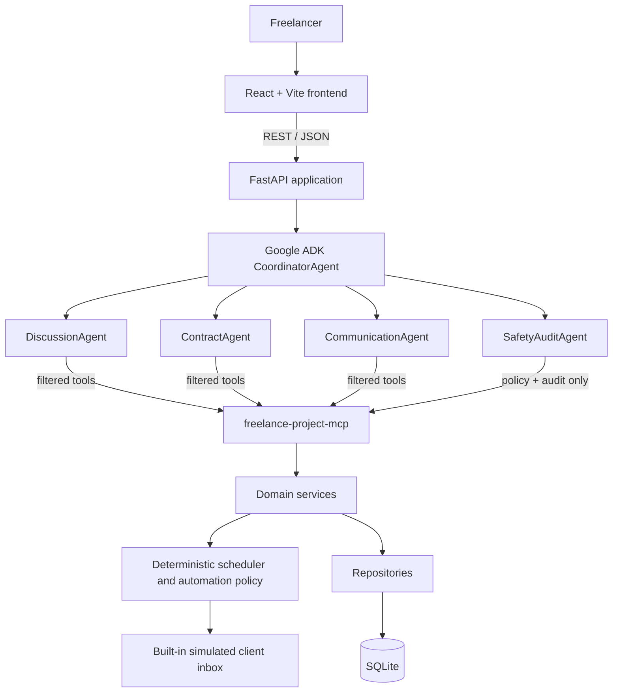
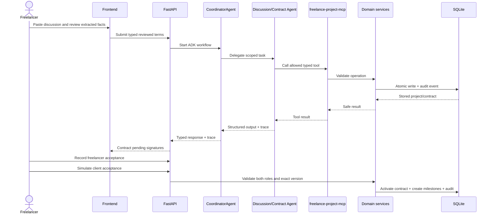
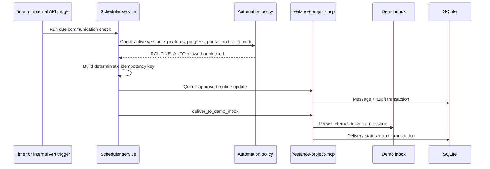

# Architecture

## Status and scope

This is the target architecture for the corrected contract-driven communication MVP. The current codebase still contains the retired evidence/payment-follow-up domain and must be migrated; this document does not claim that migration is complete.

## System context

The public browser UI and REST API are the only user-facing runtime surfaces. The MCP server is an internal STDIO child process and never listens on a network port. The built-in inbox is local application storage and UI, not an external messaging service.

## Layer responsibilities

| Layer | Responsibility | Must not do |
| --- | --- | --- |
| Frontend | Review terms, record user actions, show contracts, milestones, inbox, queue, traces, and audit | Enforce policy or fabricate traces |
| REST API | Validate typed requests, map errors, return response contracts | Contain persistence or scheduler rules |
| Coordinator | Route typed tasks and preserve trace context | Persist, sign, record progress, or deliver messages |
| DiscussionAgent | Extract stated facts and ambiguity | Invent missing terms |
| ContractAgent | Draft contract versions from reviewed facts | Activate contracts or sign for a party |
| CommunicationAgent | Draft routine updates and classify replies | Record progress, accept scope, or deliver messages |
| SafetyAuditAgent | Review message policy and wording | Broaden deterministic delivery authorization |
| MCP server | Expose approved typed internal operations | Expose public HTTP or forbidden external actions |
| Domain services | Contract, signature, milestone, queue, reply, scope-change, and audit rules | Depend on frontend state or prompt behavior |
| Scheduler service | Due-time checks, active-version checks, pause, send mode, idempotency, and demo delivery | Use LLM judgment as final delivery authority |
| Repositories | Database reads and writes | Make product-policy decisions |

## Trust boundaries

1. **Discussion/reply boundary:** user and client text is untrusted data in typed fields, never interpolated into system instructions.
2. **API boundary:** Pydantic validates public requests and responses; errors expose stable codes and safe messages.
3. **Agent boundary:** each specialist receives a separate `McpToolset` allowlist.
4. **MCP boundary:** protocol messages use stdout; operational logs use stderr; outputs contain no secrets, prompts, environment values, database paths, or stack traces.
5. **Persistence boundary:** only repositories access SQLite; agents use MCP tools.
6. **Signature boundary:** only explicit freelancer/client simulation actions create signature records; no model or scheduler can do so.
7. **Progress boundary:** only freelancer actions record milestone readiness/completion.
8. **Delivery boundary:** agents may draft or queue; only deterministic scheduler policy may deliver, and only to the built-in demo inbox.
9. **Time boundary:** storage remains UTC; display GMT preferences never mutate records or ordering.

## Agent permission matrix

| Agent | Allowed MCP tools |
| --- | --- |
| `CoordinatorAgent` | None |
| `DiscussionAgent` | `create_project_from_terms`, `save_discussion_facts`, `append_audit_log` |
| `ContractAgent` | `get_contract_template`, `create_contract_version`, `create_signature_request`, `append_audit_log` |
| `CommunicationAgent` | `get_latest_active_contract`, `get_due_communications`, `queue_routine_update`, `record_client_reply`, `create_scope_change_request`, `append_audit_log` |
| `SafetyAuditAgent` | `evaluate_automation_policy`, `append_audit_log` |

Trusted backend orchestration invokes signature acceptance, milestone progress, scheduler execution, automation pause, milestone creation, and demo-inbox delivery. These operations are not exposed broadly to agents.

## Core activation flow

## Scheduler and demo-inbox flow

The periodic task and `POST /api/internal/run-scheduled-update-check` call the same scheduler method. Re-running the method with the same event cannot duplicate a queue item or delivery.

## Scope-change flow

1. The simulated client submits a reply.
2. `CommunicationAgent` classifies it using the latest active contract.
3. A possible `SCOPE_CHANGE` creates a `ScopeChangeRequest`; no scope is modified.
4. Deterministic services pause affected milestones/messages and set project state `SCOPE_CHANGE_PENDING`.
5. `ContractAgent` may draft V2 from freelancer-reviewed changes.
6. V1 remains active until both parties accept V2.
7. On V2 activation, V1 becomes `SUPERSEDED`, milestones are reconciled, and eligible automation resumes.

## Domain model

All primary keys are UUIDs; money is stored as an integer in minor units (e.g. `fee_amount_minor: int` paired with `currency: str`); timestamps are UTC.

- `Project`: Identity, source, state, automation flag (`automation_enabled`), and current `active_agreement_version_id` (only one active contract allowed per project, enforced by a SQLite partial unique index).
- `AgreementVersion`: Immutable contract terms, version, fee details, milestone plan JSON, and lifecycle status (`DRAFT`, `PENDING_SIGNATURE`, `PARTIALLY_ACCEPTED`, `ACTIVE`, `SUPERSEDED`).
- `SignatureRecord`: Mutual acceptance source of truth. Activation requires exactly one accepted signature record for each role (Freelancer and Client) on the exact version.
- `Milestone`: Contract-derived work checkpoints. Progress recorded by freelancer or system simulation only (never AI).
- `ClientMessage`: Draft/queue/delivery state, message type, and unique idempotency key. Undelivered messages are transitioned to `CANCELLED` when a new contract version activates.
- `ClientReply`: Simulated reply and classification. Supports unsolicited messages with a nullable `client_message_id`.
- `ScopeChangeRequest`: Detected change requiring review. Automatically pauses automation.
- `AuditEvent`: Append-only safe workflow metadata. Immutable database-level SQLite triggers prevent updates or deletions.

Every significant write and audit event share a transaction.

## Deployment

The target single image uses a Node build stage and Python runtime stage. FastAPI serves `/api` and the compiled SPA on port `8000`. SQLite is stored at `/app/data/freelance_shield.db` on a Compose volume. Google model configuration is supplied through environment variables. Missing configuration fails safely without queueing or delivering messages.

The exact public host, authentication model, backup policy, retention policy, and production message-channel design remain unresolved and out of the MVP.
